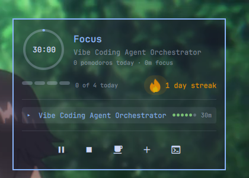

# Pomo for the Omarchy shell

The bar glyph and popup for [pomo](https://github.com/Pyasma/pomo), a
task-and-timer pomodoro CLI. On the bar: a flame with the day count beside it,
the way every streak app draws it — bright when the streak is alive, grey when
there is nothing to count. While a timer runs a ring is drawn round the
flame, its arc filling as the phase runs out, dashed while paused — one glyph
on the bar, never two.

Click it for the popup — the timer big, the goal bar, the fire, and the
task list — right-click to start or pause without opening anything, middle-click
to stop.



## Keys in the popup

| key | what it does |
|---|---|
| `↵` / `space` | start the task under the cursor; on the running task, pause / resume |
| `j` `k` `↑` `↓` | move |
| `n` | new task — type a name, `↵` adds it and starts the timer |
| `d` | tick the task under the cursor |
| `x` | delete it |
| `p` | pause / resume |
| `s` | stop |
| `b` | rest |
| `t` | open pomo's full terminal panel |
| `esc` | close |

Rows are clickable too: left starts, right ticks, middle deletes.

## Requires

- Omarchy Quattro (4.x) — the plugin runs inside `omarchy-shell`.
- The [`pomo`](https://github.com/Pyasma/pomo) CLI installed at
  `~/.local/bin/pomo` (or set **Path to the pomo executable** in the widget's
  settings). Everything shown comes from `pomo json`; every action is a
  `pomo` command. `pomo` itself needs `bash`, `jq`, `fzf`, `curl`.

The plugin reads and writes nothing of its own. State lives in pomo's data
directory, `~/.local/share/pomo/`.

## Install

```
omarchy plugin add https://github.com/Pyasma/omarchy-pomo.git
omarchy plugin enable io.github.pyasma.pomo --section right
```

The popup takes its colours and translucency from the shell's `popups`
surface, so it follows your theme. To match a translucent terminal, set the
alpha in `~/.config/omarchy/shell.toml`:

```toml
[popups]
background-alpha = 0.5
```

Then, if you want the keys, append to `~/.config/hypr/bindings.lua`:

```lua
o.bind("SUPER + ALT + P", "Pomodoro start/pause", "pomo toggle")
o.bind("SUPER + ALT + M", "Pomodoro panel", "omarchy-shell io.github.pyasma.pomo toggle")
```

## Remove

```
omarchy plugin remove io.github.pyasma.pomo
```

Nothing else is left behind; the bindings above are yours to delete.

## IPC

```
omarchy-shell io.github.pyasma.pomo toggle|open|close|refresh
omarchy-shell pomo toggle|stop|refresh          # the service, no popup
```

`pomo` calls `omarchy-shell pomo refresh` after every change, so the ring
moves the moment a timer starts rather than on the next poll.

## License

MIT
